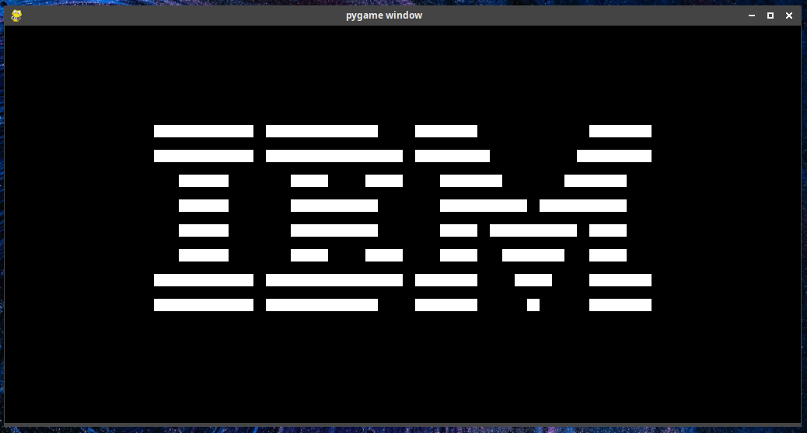

# chip8
A simple chip8 emulator in python.

## Instructions

Get pygame if you don't have it already:

    pip install --user pygame

To run a chip8 rom:

    python3 main.py <rom_path>

## References:
 1. [Cowgod's
Chip-8
Technical Reference](http://devernay.free.fr/hacks/chip8/C8TECH10.HTM)
 2. [Mastering CHIP-8 by Matthew Mikolay](http://mattmik.com/files/chip8/mastering/chip8.html)
 3. [Wikipedia article on Chip-8](https://en.wikipedia.org/wiki/CHIP-8)

the roms included in this repository were taken from the following sources:

  * https://github.com/corax89/chip8-test-rom
  * https://github.com/loktar00/chip8/blob/master/roms/IBM%20Logo.ch8